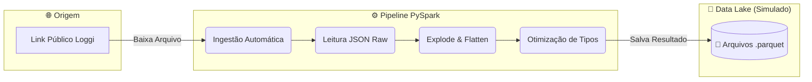
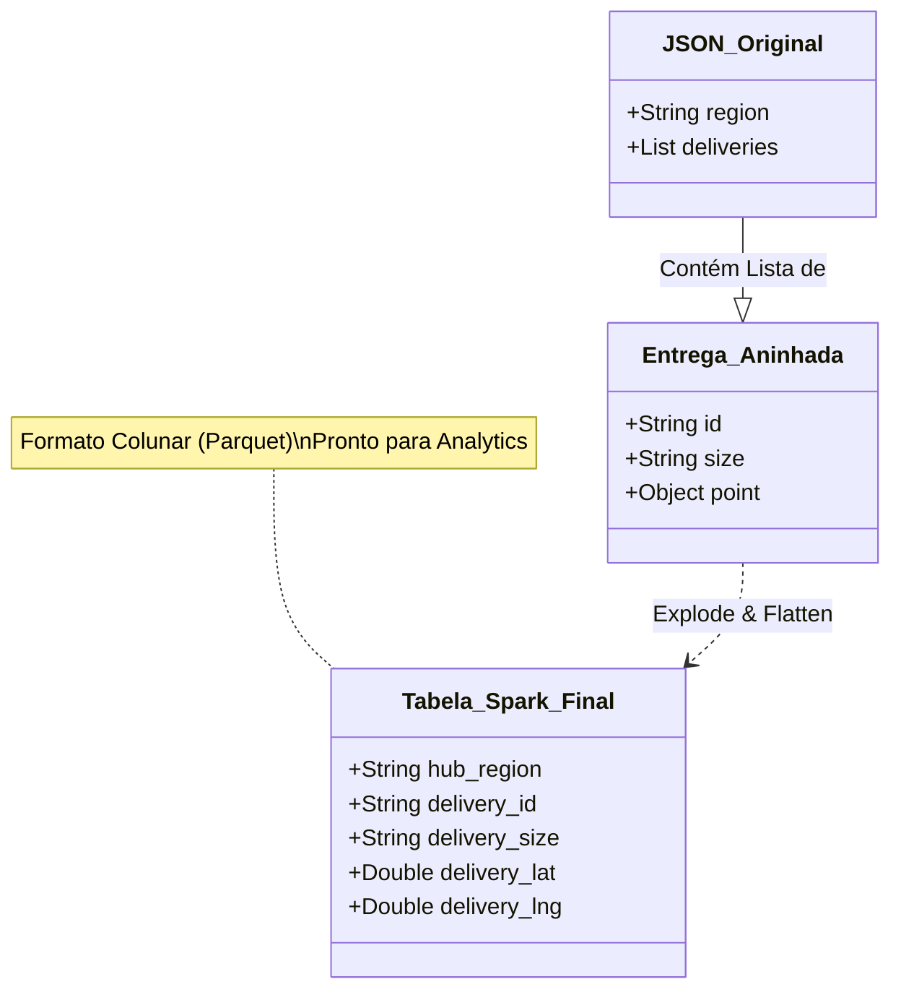

<div align="center">
  
  
  
  
</div>

# 🚚 Spark Logistics Data Pipeline

Pipeline de Engenharia de Dados desenvolvido para processar grandes volumes de dados logísticos brutos.

Este projeto resolve um desafio comum em Big Data: o processamento eficiente de arquivos **JSON semi-estruturados e aninhados**.

## 📋 Sobre o Projeto

Dados de entregas (last-mile logistics) geralmente chegam em formatos complexos onde uma única linha de registro contém arrays com múltiplas entregas, coordenadas e metadados. Processar isso com ferramentas tradicionais (como Pandas) é ineficiente em escala.

**A solução:** Utilizei o **Apache Spark (PySpark)** para criar um pipeline distribuído que:
1.  **Ingere** dados brutos da fonte automaticamente.
2.  **Explode e Achata (Flatten)** estruturas aninhadas complexas sem estourar a memória.
3.  **Otimiza** o armazenamento convertendo para **Parquet** (formato colunar com compressão Snappy), ideal para Data Lakes.

### 🛠 Tecnologias
* **Processamento Distribuído:** Apache Spark (PySpark)
* **Linguagem:** Python 3.10+
* **Armazenamento:** Parquet (Snappy Compression)
* **Conceitos:** ETL, Nested Data Flattening, Schema Inference

## ⚙️ Arquitetura do Pipeline

O fluxo de dados foi desenhado para ser autossuficiente e escalável:


```mermaid
graph LR
    subgraph Source ["🌐 Origem"]
        A[Link Público Loggi]
    end

    subgraph ETL ["⚙️ Pipeline PySpark"]
        direction TB
        B(Ingestão Automática)
        C(Leitura JSON Raw)
        D(Explode & Flatten)
        E(Otimização de Tipos)
        
        B --> C --> D --> E
    end

    subgraph Lake ["💾 Data Lake (Simulado)"]
        F[("📁 Arquivos .parquet")]
    end

    A -->|"Baixa Arquivo"| B
    E -->|"Salva Resultado"| F
```

### 🧩 O Processo de Flattening (Schema)

O desafio técnico principal foi transformar a estrutura hierárquica do JSON (onde entregas estão dentro de listas) em uma tabela relacional otimizada para análise:


```mermaid
classDiagram
    class JSON_Original {
        +String region
        +List deliveries
    }
    class Entrega_Aninhada {
        +String id
        +String size
        +Object point
    }
    
    class Tabela_Spark_Final {
        +String hub_region
        +String delivery_id
        +String delivery_size
        +Double delivery_lat
        +Double delivery_lng
    }

    JSON_Original --|> Entrega_Aninhada : Contém Lista de
    Entrega_Aninhada ..> Tabela_Spark_Final : Explode & Flatten
    note for Tabela_Spark_Final "Formato Colunar (Parquet)\nPronto para Analytics"
```

## 🚀 Como Executar

### Pré-requisitos
* Python 3.10+ instalado.
* Java (JDK 8 ou 11) configurado (necessário para rodar o PySpark localmente).
* **Ou:** Rodar em ambiente Cloud (Databricks/Colab/EMR).

### Passo a Passo
1.  Clone o repositório.
2.  Crie um ambiente virtual e instale as dependências:
    ```bash
    python -m venv .venv
    source .venv/bin/activate  # No Windows: .venv\Scripts\Activate
    pip install -r requirements.txt
    ```
3.  Execute o pipeline:
    ```bash
    python src/etl_loggi.py
    ```
4.  O resultado estará na pasta `output/loggi_processed`.

## 📊 Estrutura de Dados (Output)

O arquivo Parquet final terá a seguinte estrutura tabular (exemplo):

| Coluna | Tipo | Descrição |
| :--- | :--- | :--- |
| `hub_name` | String | Nome do Centro de Distribuição |
| `hub_region` | String | Região (ex: df-1) |
| `delivery_size` | Integer | Tamanho do pacote (1-10) |
| `delivery_lat` | Double | Latitude do ponto de entrega |
| `delivery_lng` | Double | Longitude do ponto de entrega |

